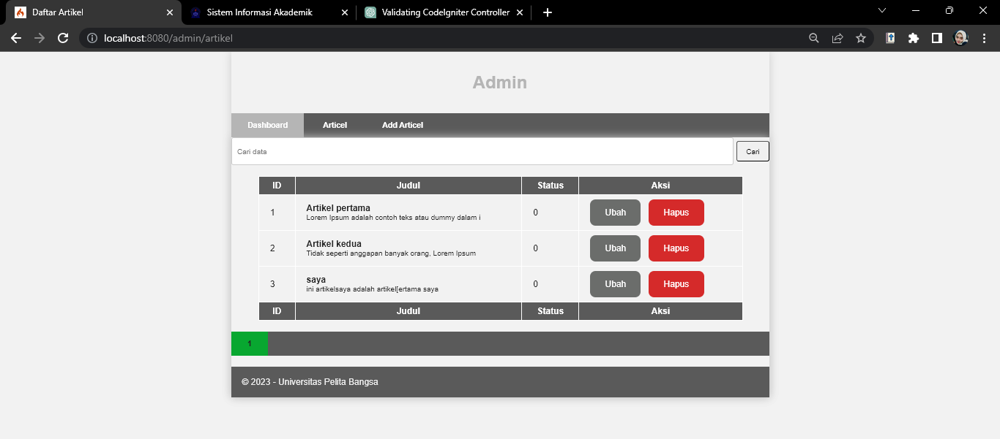

# Lab10Web

### Membuat PHP Frame Work (Codeigniter) Lanjutan <b>

Ini merupakan tugas membuat PHP  Frame Work dengan menambahkan Pagination dan Pencarian.

1. Membuat Pencarian
```
public function admin_index()
{
$title = 'Daftar Artikel';
$q = $this->request->getVar('q') ?? '';
$model = new ArtikelModel();
$data = [
'title' => $title,
'q' => $q,
'artikel' => $model->like('judul', $q)->paginate(10), # data
dibatasi 10 record per halaman
'pager' => $model->pager,
];
return view('artikel/admin_index', $data);
}
```
>Untuk membuat pencarian data, buka kembali Controller Artikel, pada method
admin_index ubah kodenya seperti di atas.

2. Dan ubah link pager ubah seperti berikut pada admin_index.php
```
<?= $pager->only(['q'])->links(); ?>
```

### OUTPUT <b>



> ini merupakan halaman artikel ketika mencari data yang diinginkan dan akan muncul seperti gambar di atas.